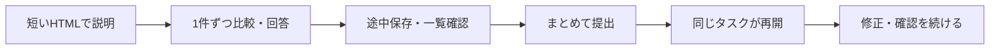

# Astra Dev Harness

**Astraと、相談から開発・確認・引き継ぎまで進めるための運用セットです。**

ゲーム・アプリ・Webサービスで共通して使えるルール、スキル、ひな型、ローカルツールを収録しています。

作品のコード・素材・物語・仕様、個人情報、元の製品のGit履歴は含めません。
OpenAI公式製品ではありません。[MITライセンス](LICENSE)で再利用できます。現在のGitHub公開範囲は非公開です。

## まずは、こう頼めます

| 言い方 | ハーネスがすること |
| --- | --- |
| **セットアップして** | 環境を調べ、必要ファイルを配置し、既存ルールと統合。使える機能・本人の操作待ちを確認 |
| **ぬ** / 次なに | タスク一覧をHTMLで表示。選択・コメント・提出から同じCodexタスクで続ける |
| 仕様を相談したい。まだ実装しないで | 調査し、図解・比較案を提示。判断を仕様にまとめる |
| これを直して / 作って | 目的と守る動作を確認し、実装・レビュー・修正・必要な検証まで進める |
| 後でやるタスクに追加して | 仕様と完了条件を記録し、一覧へ登録。実装は始めない |
| **Geminiレスキュー** | 実画面のデザインや創作を相談し、親が回答の根拠を確認 |
| **GPT-6 Proに相談して** | 必要な差分だけの資料を作り、内蔵ブラウザの指定モデルへ相談 |
| **LESSONに残して** | 再発条件・原因・予防策を記録し、次の関連作業で読む |
| 順番に進めて。離席します | 承認済みタスクを依存順に進め、完了・未完・再開点を残す |
| **ハンドオーバー** | 記録・教訓・検証をそろえ、設定した範囲のcommit・PR・merge・後片付け |
| リリースノートを作って | 前回の実配布版からの変更を、利用者向けの言葉で整理 |

「ぬ」などの一文字は開始のショートカットです。質問への短い回答や意味のある入力と取り違えません。
タスクが空でも空の一覧を表示します。新しい作業を勝手に作りません。

## 見て、その場で回答する



- 説明は一画面一テーマの短い図解。チャットは結論と入口を中心にします。
- 選択と自由記入、途中保存、一覧確認、一括提出を用意しています。
- **PCへの保存・Codexへの通知・同じタスクでの受領を別々に表示**します。
- 同じ資料のURLと保存キーを保ち、改訂前の入力も残します。
- 提出イベントで再開する仕組みです。回答待ちのためにLLMを常時動かしません。

説明専用表示は単独でも使えます。回答による自動再開はCodexデスクトップとの実接続が必要です。
[HTML回答の手順](docs/harness/workflows/html-feedback.md)

## 導入は「読み込ませて、セットアップ」

導入先をCodexで開き、このリポジトリの[SETUP.md](SETUP.md)を読み込ませ、こう伝えます。

> このハーネスを、このプロジェクトにセットアップして。

親が調査・配置・既存ルールとの統合・検証まで担当します。
既存AGENTS.mdや製品設定を一括上書きせず、導入先に合わせたPROJECT.mdを整えます。
同梱の配置ツールは許可一覧だけを使い、同名の変更済みファイルは保持して親へ統合を引き継ぎます。
既存のpackage.json、タスク、回答、個人スキルは置き換えません。

**必要なもの：** Python 3.10以降、Node.js 22以降、Git。GitHub操作にはgh。
追加のnpm/pipパッケージは不要です。不足する環境の導入もセットアップ手順に含みます。

| 機能 | 導入時に必要なもの |
| --- | --- |
| 開発ルール・タスク・教訓・検査 | ローカルファイルと実行環境 |
| HTML表示・回答からの再開 | Codexデスクトップ、ブラウザ操作、同じタスクとの接続確認 |
| Geminiレスキュー | Gemini APIキーと利用条件の確認。キーは本人が非表示入力 |
| GPT-6 Pro相談 | ChatGPTへのログイン、指定モデルの利用権、ブラウザの添付操作。OpenAI APIキーは不要 |
| GitHubへの引き継ぎ | GitHub認証、対象repo・統合先・Git完了の範囲 |
| 画像・音・動画の実制作 | 導入先で選んだ制作ツール・素材・利用権。必要なものを接続 |

本人のログイン、キー発行、課金・契約、管理者承認は自動取得できません。
その部分だけを分け、独立した機能の準備は進めます。
設定の存在、dry-run、実接続の成功は区別して報告します。
製品のLICENSEは保持し、ハーネスのライセンス表記はdocs/harness/LICENSEへ配置します。
[詳しい導入手順](docs/harness/setup.md)

## 中に入っているもの

| 運用 | 内容 |
| --- | --- |
| 調査・実装 | 親Astraが担当。守る契約を追い、原因を解消する変更を選ぶ |
| レビュー・検証 | 自己レビュー、条件に応じた独立レビュー、指摘修正、必要な回帰確認 |
| 画面・操作 | 情報の優先順位、読みやすさ、全画面の重複、実操作、失敗・戻る |
| 保存・AI・権限 | 互換性、中断・再試行、不正応答、権限境界、実データの保護 |
| 教訓・引き継ぎ | 関連LESSONの検索と更新、記録、Git統合、所有する作業場所の後片付け |
| 制作・配布 | 素材の権利、編集可能なデータ、完成品の確認、配布QA、更新情報 |
| 外部相談 | Gemini画像/創作相談、GPT-6 Pro資料作成・送信・回収の手順 |
| 導入ツール | 環境点検、許可一覧による配置、競合保持、文書・task・lesson・配布内容の検査 |

[運用の対応表](docs/harness/coverage.md)で収録範囲を確認できます。
外部の生成エンジンや配布サービスそのものは同梱しません。接続と制作の手順を収録しています。

```text
AGENTS.md                    毎回読む条件と手順への入口
SETUP.md                     「セットアップ」の入口
PROJECT.md                   導入先の環境・契約・Git完了の範囲
.agents/skills/astra-*/       普段の言い方から手順を見つけるスキル
docs/harness/workflows/      場面ごとの運用フロー
docs/harness/NEXT_TASKS.md   タスク一覧
docs/harness/LESSONS.md      教訓の索引
docs/harness/templates/     仕様・レビュー・引き継ぎ・HTMLのひな型
tools/harness/              導入・検査・HTML受付・外部相談
.local/                     実資料・回答・相談結果など（Git対象外）
screenshots/                確認用画像（Git対象外）
```

## 安全と、確認できている範囲

- 作品の内容・実データ・個人情報・秘密値を共有パッケージへ逆流させません。
- Gitの作業branch、別作業の保護、private/publicの区別、作者情報の確認を手順に含めます。
- 公開、課金、破壊的操作、製品の意味が変わる判断は、現在の依頼と導入先の承認範囲に従います。
- 読み取り検査は秘密の完全検出を保証しません。内容・画像・送信範囲を親も確認します。
- HTMLの保存・通知・同じタスクへの自動再開はWindows版Codexデスクトップで確認しています。
- Geminiの認証とモデル情報取得、ChatGPTのログインと6 Proの選択表示を確認しています。生成・資料送信の確認とは区別しています。
- 導入先ごとの接続、Geminiの生成・GPT-6 Proへの実資料送信は導入時・相談時に確認します。
- HTML通知は交換可能なデスクトップ接続アダプターを使います。アプリ更新後の互換性を保証する公開APIではありません。

**v0.4.0の確認状況**

| 対象 | 確認したこと |
| --- | --- |
| Windows・macOS・Linux | Node.js 22 / Python 3.10のCIが成功。41件の検証（macOS/LinuxではWindows専用1件は対象外） |
| 導入と更新 | 新規・既存・CommonJSの製品、既存設定とLICENSEの保持、再実行、参照先と実行用ファイルの配置 |
| 保存・秘密情報 | 回答の保存/再開、除外解除の拒否、リンク先の拒否、APIキーをエラーへ出さないこと |
| HTMLの自動再開 | Windows版Codexデスクトップで提出→同じタスクの再開→受領を確認 |
| 外部相談 | Geminiの認証・モデル情報取得と、ChatGPTの6 Pro選択表示を確認。実生成・実資料送信は未確認 |

自己レビューと独立レビューで見つかった問題を修正し、回帰確認と再レビューを完了しています。
macOS/LinuxのCodexデスクトップ接続、スマホ・LAN/Tailscaleの実機接続は導入先で確認してください。

このrepoは、内容監査済みのファイルだけを新しい独立履歴へ書き出した公開候補です。旧PRやキャッシュは持ち込んでいません。
新規cloneから内容・履歴・作者情報を再検査し、旧問題commitがこのrepoから取得できないことも確認済みです。
**この公開候補では、GitHub側の作者設定を確認するまでPRを作りません。** PRの仮マージにも作者メールが入るためです。
設定確認は本人のGitHub画面と非公開の検証用repoで行います。それまでは承認済みcommitのレビューと作者情報を保つ統合を使います。
公開への切替は、所有者の明示指示があるまで行いません。

[検証記録](docs/harness/validation.md) · [配布前の確認](docs/harness/publication.md) · [文書の配置](docs/harness/documentation-map.md)

保管・送信するデータの範囲は[セキュリティの説明](SECURITY.md)、変更を加える手順は[保守への参加](CONTRIBUTING.md)を参照してください。

## 保守用コマンド

```sh
npm run docs:check
npm test
npm run test:feedback
npm run test:setup
npm run harness:doctor
npm run harness:scan
```

導入先では既存package.jsonを維持するため、[導入手順](docs/harness/setup.md)の直接実行コマンドを使えます。
この検査はハーネス向けです。導入先製品の動作試験は、その製品の契約に合わせて行います。
